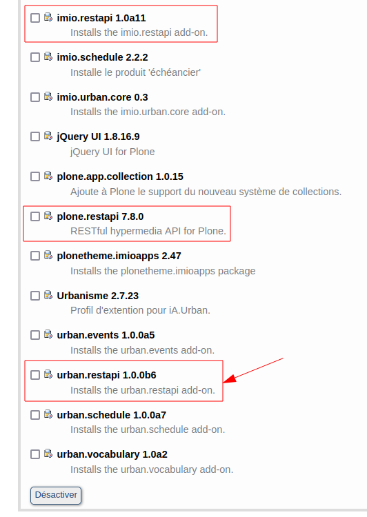

==========================================================================
urban.restapi.client
==========================================================================

:code:`urban.restapi.client` est un simple produit qui permet d'importer des contacts (Architectes, Notaires, Géomètres) et Lotissements (Parcellings) en contactant l'API du produit Urban (:code:`urban.restapi`)

On peut facilement activer :code:`urban.restapi` sur une instance Urban en activant les modules liés : 

:code:`urban.restapi` a besoin de :code:`imio.restapi` qui a besoin de :code:`plone.restapi`